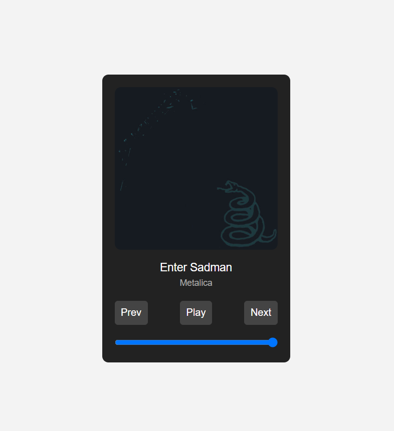

# Music Player App

A simple music player built with HTML, CSS, and JavaScript that allows users to play, pause, and navigate through songs. This app also includes a cover image for each song and displays the artist's name below the song title.

## Features

- Play and Pause functionality
- Skip to Next or Previous song
- Volume control
- Display song title and artist's name
- Display cover image for each song
- Supports local music files

## Technologies Used

- HTML
- CSS
- JavaScript

## Getting Started

1. Clone or download this repository to your local machine.
2. Place your music files (e.g., `.mp3` format) and cover images (e.g., `.jpg`) in the project folder.
3. Edit the `script.js` file to add your own songs and their cover images.
   - The `songs` array should contain objects with the following properties:
     - `title`: The title of the song.
     - `artist`: The name of the artist.
     - `src`: The file path to the song (e.g., `song1.mp3`).
     - `cover`: The file path to the cover image (e.g., `cover1.jpg`).
4. Open the `index.html` file in your browser to start the music player.

## How to Customize

You can easily add more songs by modifying the `songs` array in the `script.js` file. For each song, add the song title, artist name, file source (`src`), and the cover image (`cover`).

## Demo

## License

This project is open-source and available under the [MIT License](LICENSE).
